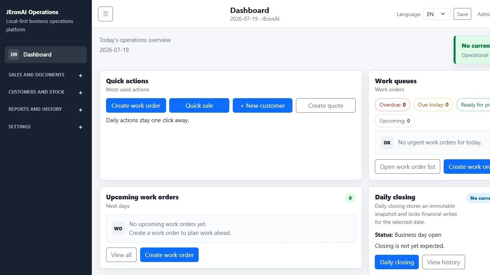
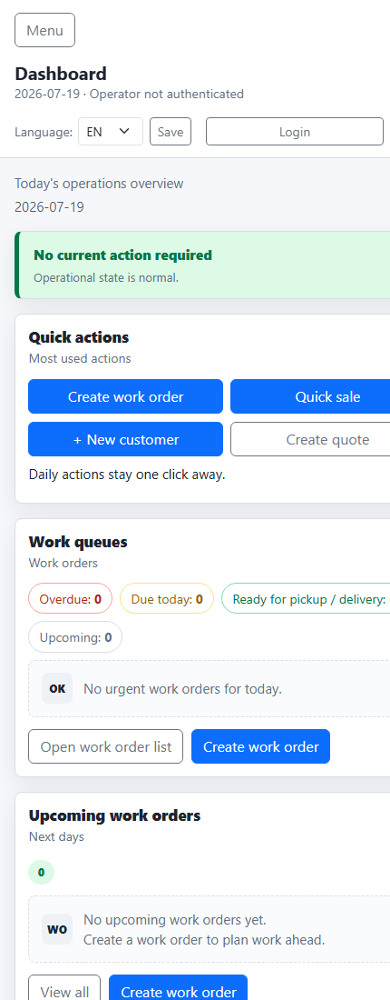

# Local-First Operations Tracker

A configurable local-first work order and operations tracker for small businesses.

## Portfolio Summary

This project demonstrates a pragmatic FastAPI business application built around real small-business workflows: work orders, customer history, product pricing, receipts, seller shifts, sales, refunds, cash handling, daily closing, immutable financial snapshots, backups, and bilingual Finnish/English UI support.

The goal is not to imitate a SaaS landing page. The app focuses on operational correctness, auditability, local-first use, and maintainable server-rendered workflows that can run on a company-owned computer and be accessed from nearby devices.

## UI Preview

The current dashboard is designed as an operations view rather than a marketing page. It shows daily work order pressure, shift status, daily closing state, recent activity, and upcoming work in one browser screen.

More UI screenshots are available in [`docs/UI/Screenshots.md`](docs/UI/Screenshots.md).

### Browser Dashboard



### Mobile Dashboard

The mobile layout uses the same server-rendered UI with a single-column dashboard suitable for phone use over LAN or Tailscale.



## Current MVP Status

This repository contains an early but usable FastAPI MVP. It is intended to run on one company-owned Windows computer and serve other computers, tablets, and phones through a browser on the local network or through Tailscale.

The app is not intended to be exposed directly to the public internet.

## Implemented Features

- Dashboard with real work order counts and attention lists
- Customer CRUD and customer work order history
- Work Order CRUD through `/work-orders`
- Legacy `/jobs` routes kept for backwards compatibility
- Configurable work order statuses in Settings
- Products and services with CSV price list import
- Work order item rows with VAT-inclusive pricing
- Sequential receipt numbers independent from database IDs
- Printable receipt / work order preview with stored print snapshot
- Settings for company details, VAT default, receipt prefix, and language
- Finnish and English UI text baseline
- Local login with signed session cookie, first-admin setup, password hashes, and operational roles for Admin, Manager, Seller, and Read only
- Cash registers and seller shifts with starting cash, cash movements, closing count, expected cash, and over/short calculation
- Sales, payments, and refunds stored separately from Work Orders
- Daily closing with immutable versioned snapshots, closed-day write lock, VAT/payment/seller summaries, and authorized reopen flow
- Read-only browsing for historical daily closing snapshot versions
- Seller reports for daily, weekly, and monthly sales metrics
- Sales report totals
- Goods receipts with freight and additional landed cost allocation
- Weighted-average inventory cost and ex-VAT inventory valuation
- Inventory movement ledger, receipt cancellation by reversal, and valuation reports
- Audit log
- SQLite backups using SQLite's backup API
- Backup restore, health status, and retention cleanup
- Automatic background backup scheduler with configurable interval and retention
- Alembic baseline migration for the current schema
- Centralized HTML and JSON error handling
- Dockerfile and Docker Compose support for the SQLite local-first deployment
- GitHub Actions pytest workflow for push and pull request checks
- LAN/Tailscale run script support

## Known Limitations

- Authentication is local-session based and intended for a trusted company network; it is not hardened for public internet exposure
- Some operational forms still preserve seller/admin selectors for MVP workflows. Route-level session checks now protect access, but deeper current-user ownership enforcement is still a future hardening step.
- No cloud deployment, PostgreSQL, or object storage
- No native mobile application
- Backup scheduler is in-process and intended for the local single-computer deployment model; use an external scheduler for stricter production guarantees
- Alembic has a baseline migration for new databases, but existing SQLite databases are not migrated automatically on application startup
- Receipt numbering is local-MVP safe, but not designed for high-concurrency multi-server use
- Money columns now use SQLAlchemy `Numeric`; existing SQLite columns may still have older storage affinity until a future migration rebuilds the tables
- Bootstrap CSS and JavaScript are bundled locally under `app/static/vendor/bootstrap`; the app does not require a CDN for the normal UI
- Sales UI creates one sale line and one payment today. The data model is prepared for more rows, but split/partial payments and multi-line sale finalization are not yet implemented.
- Multi-VAT refunds are rejected until line-level refund allocation is implemented.

## Sales, Shifts, Refunds, And Daily Closing

Work Orders, Sales, Payments, and Refunds are separate business objects. A Sale may link to a Work Order, but a Work Order is not treated as the payment record.

Daily closing rules:

- All shifts for the business date must be closed before the day can be closed.
- Closing creates a stored immutable snapshot with a version number.
- A closed business date blocks new shifts, sales, refunds, cash movements, and shift closing for that date.
- Only reopening the Daily Closing unlocks that date.
- Re-closing after reopen creates a new snapshot version and preserves older snapshot rows.
- Refunds cannot exceed the original sale total cumulatively.
- Refunds are recorded on the current open refund shift and the refunding seller, not on the original sale shift.
- The original sale remains on its original sale date and seller. Later refunds reduce the refund day and refunding seller totals.
- Refund VAT is stored with the refund. Single-VAT sales are supported; multi-VAT refunds require future line allocation.
- Snapshot version history is available from the Daily Closing detail page.

Security notes:

- Create the first admin at `/setup`, then use `/login`.
- Passwords are stored as PBKDF2-SHA256 hashes.
- Signed HTTP-only session cookies are used for local browser sessions.
- Admin and Manager roles can access administration routes. Read only users cannot perform write requests.
- The app is still not intended to be exposed directly to the public internet.

## Inventory Costing

Inventory valuation is based on ex-VAT cost. VAT is stored and shown, but deductible VAT is not included in inventory value by default.

Goods receipts are created as drafts. Draft receipts do not affect stock, balances, weighted average cost, or valuation. Posting a receipt allocates freight and other landed costs, creates inventory movements, updates location balances, updates product-level totals, and writes audit events in one transaction.

Default landed cost allocation is by purchase value:

```text
line share = line purchase value / total receipt purchase value
allocated freight = receipt freight total * line share
allocated other costs = receipt other costs total * line share
landed unit cost = (line purchase value + allocated freight + allocated other costs) / quantity
```

Quantity-based allocation is also supported. Monetary allocations are rounded to 2 decimals and the final rounding remainder is assigned to the last line deterministically, so allocated freight and additional costs reconcile exactly to the receipt totals.

Weighted average cost uses 6 decimal places internally:

```text
old value = old quantity * old weighted average cost
new receipt value = received quantity * landed unit cost
new average cost = (old value + new receipt value) / (old quantity + received quantity)
```

Inventory value is stored as the actual ex-VAT movement value rounded to 2 decimals. Negative stock is rejected by default because it would make weighted average cost ambiguous. Posted receipts are immutable; cancellation creates reversal movements instead of deleting history.

## Technology Stack

- Python
- FastAPI
- SQLite
- SQLAlchemy classic Column models
- Jinja2
- Bootstrap
- Pytest
- Uvicorn

## Quick Start On Windows

Clone the repository:

```powershell
git clone https://github.com/denzo69/Local-First-Operations-Tracker.git
cd Local-First-Operations-Tracker
```

Start the local development server:

```powershell
.\run.bat
```

Open:

```text
http://127.0.0.1:8000
```

Create the first admin account:

```text
http://127.0.0.1:8000/setup
```

Health check:

```text
http://127.0.0.1:8000/health
```

## Docker

Docker is optional. The compose setup runs the app with SQLite stored in a named volume and backups stored in a separate named volume.

```powershell
docker compose up --build
```

Then open:

```text
http://127.0.0.1:8000
```

Before real use, change `SECRET_KEY` in `docker-compose.yml` or provide it through your environment. The Docker setup intentionally keeps the current local-first SQLite model; PostgreSQL and object storage are not enabled yet.

Run the full test suite:

```powershell
.\.venv\Scripts\python.exe -m pytest
```

Create or upgrade a database through Alembic:

```powershell
.\.venv\Scripts\python.exe -m alembic upgrade head
```

Optional backup scheduler environment settings:

```text
BACKUP_SCHEDULER_ENABLED=true
BACKUP_SCHEDULER_INTERVAL_MINUTES=1440
BACKUP_RETENTION_COUNT=50
```

## Local Network And Tailscale Access

Use the LAN script when another device should access the app:

```powershell
.\run-lan.bat
```

Then open the server computer's LAN or Tailscale address in a browser, for example:

```text
http://100.x.x.x:8002
```

Only use this on trusted private networks or Tailscale. Do not port-forward the development server to the public internet.

## Data And Backups

Default local database:

```text
data/app.sqlite
```

Default backup folder:

```text
backups/
```

Backups are created with SQLite's backup API, validated with `PRAGMA integrity_check`, and listed in the Backups page. Restore creates a safety backup before replacing the current database.

## Print Snapshots

Opening the printable receipt / work order route creates one stored snapshot for that document type. Later edits to the live work order do not rewrite the stored snapshot. Reopening the same printable route reuses the existing document number and snapshot.

## Documentation

Design documents live in `docs/`:

- `docs/Vision.md`
- `docs/Projektisuunnitelma_v1.md`
- `docs/Software_Design_Document.md`
- `docs/Architecture.md`
- `docs/Backup_and_Failover.md`
- `docs/Database.md`
- `docs/API.md`
- `docs/Roadmap.md`
- `docs/UI/Wireframes.md`
