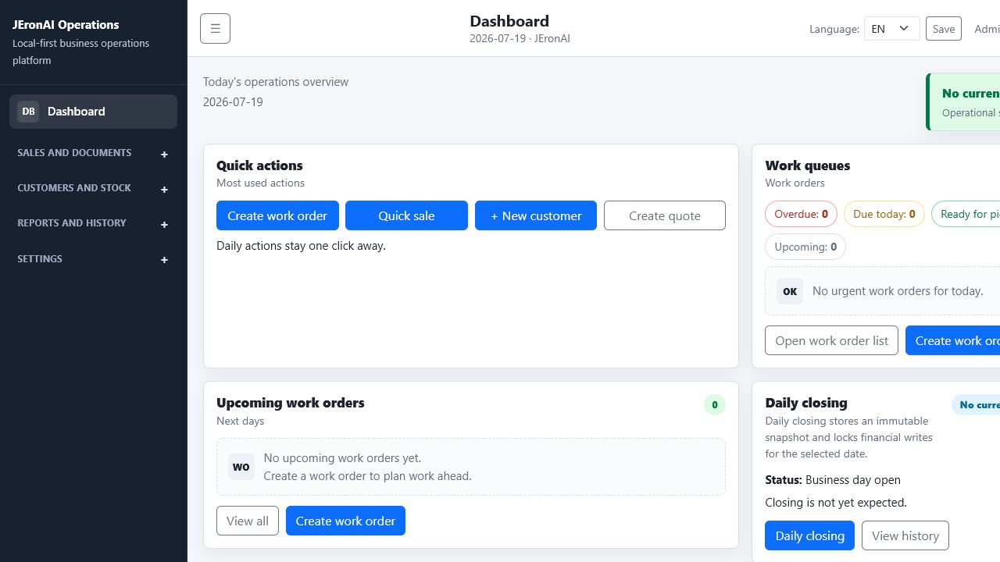
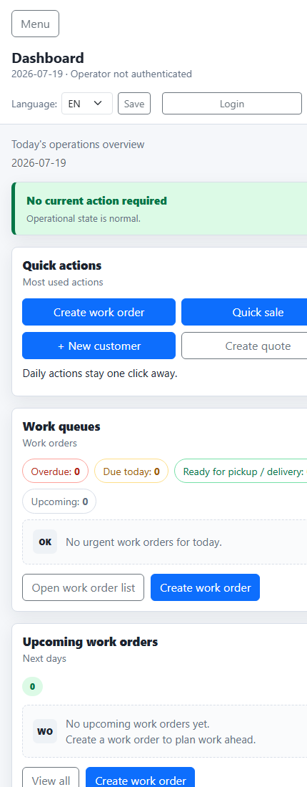

# JEronAI Operations

[](https://github.com/denzo69/-Local-First-Operations-Tracker-Commercial/actions/workflows/tests.yml)


**A local-first ERP and CRM portfolio project for small-business operations.**

JEronAI Operations is a browser-based business application built with FastAPI, SQLite, SQLAlchemy, Jinja2, and Bootstrap. It demonstrates how customer management, operational documents, sales, inventory control, daily closing, reporting, audit history, and backups can be combined into one maintainable local-first system.

> This is an actively developed portfolio and product-development project. It is not a finished accounting suite, certified cash register, payment platform, or statutory e-invoicing product.

## Highlights

- Local-first deployment on company-owned hardware
- Responsive browser interface for desktop, tablet, and phone
- Customer, product, service, warehouse, supplier, and user registers
- Work Orders, Quotes, Delivery Notes, and document conversion workflows
- Direct Sales and document-based Sales
- Cash, card, split-payment, refund, and external Invoice Handoff workflows
- Daily Closing with stored historical snapshots
- Goods Receipts, Stock Balances, Inventory Transactions, weighted-average costing, and Inventory Valuation
- Reporting, Audit Log, database migrations, backups, and restore
- Local authentication and operational user roles
- Finnish and English user-interface support
- Automated pytest test suite with coverage reporting

## Portfolio Summary

This project demonstrates a pragmatic FastAPI business application built around real small-business workflows: CRM, Work Orders, customer history, product pricing, receipts, seller shifts, Sales, refunds, cash handling, Daily Closing, immutable financial snapshots, backups, and bilingual Finnish/English UI support.

The goal is not to imitate a heavyweight enterprise suite or a polished SaaS landing page. The application focuses on understandable workflows, operational correctness, auditability, local-first use, and maintainable server-rendered screens that can run on a company-owned computer and be accessed from nearby trusted devices.

## UI Preview

The application is designed for everyday operational work: start from a customer or Work Order, complete a Sale only when the transaction is final, follow external invoicing separately, and close the business day from one operations dashboard. Quotes do not affect stock. Delivery Notes reserve and reduce stock products for the customer, while service and manual work rows remain non-stock-affecting.

The current dashboard prioritizes quick actions, work queues, upcoming Work Orders, recent activity, Sales, Invoice Follow-up, and Daily Closing status in one browser screen.

### Desktop Dashboard



### Mobile Dashboard

The mobile experience is a responsive browser interface, not a native mobile application.



## Current MVP Status

This repository contains an early but usable FastAPI MVP. It is intended to run on one company-owned Windows computer or Docker host and serve other computers, tablets, and phones through a browser on a trusted local network or through Tailscale.

The application is not intended to be exposed directly to the public internet.

## Implemented Features

- Dashboard with real Work Order counts and attention lists
- Customer CRUD and customer Work Order history
- Work Order CRUD through `/work-orders`
- Delivery Notes through `/delivery-notes` for customer-specific reservations, deliveries, and Invoice Handoff workflows that reserve and reduce stock products
- Quotes through `/quotes` for pricing products and work without reducing inventory
- Legacy `/jobs` routes kept for backwards compatibility
- Configurable Work Order statuses in Settings
- Products and services with CSV price-list import
- Products workspace for product master data, warehouses, shelf locations, Goods Receipts, Stock Balances, Inventory Transactions, Inventory Valuation, and reconciliation
- Work Order item rows with VAT-inclusive pricing
- Sequential receipt numbers independent from database IDs
- Printable receipt and Work Order previews with stored print snapshots
- Settings for company details, default VAT, receipt prefix, and language
- Finnish and English UI text baseline
- Local login with signed session cookies, first-admin setup, password hashes, and operational roles for Admin, Manager, Seller, and Read only
- Optional Cash Registers and Seller Shifts with starting cash, cash movements, closing count, expected cash, and over/short calculation
- Sales, Payments, and Refunds stored separately from Work Orders
- Unified sales flow for direct Quick Sales and Work Order billing
- Work Orders can be converted into Sales and settled by cash, card, split payment, or Invoice Handoff
- Invoice queue for external invoicing handoff, payment-status checks, unpaid follow-up, and reminder tracking; this is not statutory invoicing
- Daily Closing with immutable versioned snapshots, closed-day write lock, VAT/payment/seller summaries, and authorized reopen flow
- Read-only browsing for historical Daily Closing snapshot versions
- Seller reports for daily, weekly, and monthly sales metrics
- Sales report totals
- Goods Receipts with freight and additional landed-cost allocation
- Weighted-average inventory cost and ex-VAT Inventory Valuation
- Immutable Inventory Transaction ledger, receipt cancellation by reversal transaction, and valuation reports
- Sale-line cost-of-goods-sold and gross-profit snapshots based on weighted-average cost at sale time
- Audit Log
- SQLite backups using SQLite's backup API
- Backup restore, health status, and retention cleanup
- Automatic background backup scheduler with configurable interval and retention
- Safe Alembic migration bootstrap for new and legacy unstamped SQLite databases
- Centralized HTML and JSON error handling
- Dockerfile and Docker Compose support for the SQLite local-first deployment
- GitHub Actions pytest workflow for push and pull-request checks
- LAN and Tailscale run-script support

## Known Limitations

- Authentication is local-session based and intended for a trusted company network; it is not hardened for public-internet exposure
- Some operational forms still preserve seller/admin selectors for MVP workflows. Route-level session checks protect access, but deeper current-user ownership enforcement remains a future hardening step
- No cloud deployment, PostgreSQL, or object storage
- No native mobile application
- The backup scheduler is in-process and intended for the local single-computer deployment model; use an external scheduler for stricter production guarantees
- Alembic is the versioned schema source of truth. Windows run scripts and Docker startup run `python -m app.migration_bootstrap`; direct `uvicorn app.main:app` startup still requires migration bootstrap when schema changes exist
- Receipt numbering is suitable for the local MVP model but is not designed for high-concurrency multi-server use
- Money columns use SQLAlchemy `Numeric`; existing SQLite columns may retain older storage affinity until a future migration rebuilds the tables
- Bootstrap CSS and JavaScript are bundled locally under `app/static/vendor/bootstrap`; the normal UI does not require a CDN
- Sales support multiple lines and multiple immediate payments. Full accounting invoicing, payment gateways, fiscal cash-register certification, and statutory e-invoicing are not implemented
- External invoice or e-invoice integration is not implemented. The invoice queue is a manual Invoice Handoff and Invoice Follow-up workflow
- Multi-VAT refunds are rejected until line-level refund allocation is implemented
- Refunds do not yet create customer-return stock movements. A financial refund leaves inventory unchanged until a dedicated return workflow is implemented

## Sales, Shifts, Refunds, And Daily Closing

Work Orders, Sales, Payments, and Refunds are separate business objects. A Sale may link to a Work Order, but a Work Order is not treated as the payment record.

A Work Order is operational, not financial. When it becomes billable, it is converted into a Sale. That Sale stores immutable line snapshots, credited seller, operator, Seller Shift, Cash Register, VAT totals, inventory COGS snapshots, and settlement status.

The operational document family includes Work Orders, Delivery Notes, and Quotes. A Quote can price products or work without reducing inventory. A Delivery Note represents products reserved, delivered, or prepared for a customer before final settlement and therefore reserves and reduces stock products immediately. Service and manual work rows do not reduce stock. Quotes and Delivery Notes can be converted into Work Orders, Sales, or Invoice Handoff records. When a Delivery Note is converted into a Sale, its existing stock issue is reused for cost reporting and stock is not reduced a second time.

Seller Shifts are optional by default. Small businesses, sole traders, and mobile workers can complete Sales without opening a shift. A shift-linked Sale uses the shift business date and Cash Register and is included in shift closing. A shiftless Sale stores its own business date, may optionally reference a Cash Register, and remains visible in reports and Daily Closing without appearing in a shift closing.

Credited seller attribution is optional. The logged-in operator is used as seller by default when eligible. Operator identity remains stored separately from credited seller, payment receiver, and inventory actor.

Direct Quick Sales and Work Order billing use the same sales service:

- `/sales/quick` for direct retail or POS Sale
- `/sales/work-orders/{id}` for Work Order review and payment or Invoice Handoff
- `/sales/invoice-queue` for Sales awaiting external invoicing

Settlement and Invoice Follow-up states include paid, partially paid, awaiting invoice, transferred to invoicing, payment check due, unpaid, reminder due, reminder sent, and cancelled. Cash, card, bank transfer, mobile, and other immediate payments create `Payment` rows. Sending a Sale to external invoicing does not create a fake immediate payment. Partial and split payments are supported, and overpayment is rejected.

External Invoice Handoff can store the invoicing service, external invoice number, invoice date, due date, optional reference or URL, and notes. The application does not assume an external invoice has been paid without explicit confirmation. Overdue follow-up dates can appear as dashboard alerts, and paid, unpaid, and reminder actions are audited.

Every finalized Sale receives one unique sequential Sale document number. Work Order numbers and external invoice numbers remain separate references.

Seller and operator identity remain separate:

- `Sale.sold_by_user_id` credits the seller for reports and receipts
- `Sale.created_by_user_id` records the authenticated operator who created the Sale
- `Payment.received_by_user_id` records who received or recorded each Payment
- `InventoryTransaction.created_by_user_id` records who caused the stock issue

Daily Closing rules:

- All Seller Shifts for the business date must be closed before the day can be closed
- Closing creates a stored immutable snapshot with a version number
- A closed business date blocks new shifts, Sales, Refunds, cash movements, and shift closing for that date
- Reopening the Daily Closing unlocks the date
- Re-closing after reopen creates a new snapshot version and preserves older versions
- Refunds cannot cumulatively exceed the original Sale total
- Refunds are recorded on the current refund date and refunding seller, not on the original Sale date
- Single-VAT refunds are supported; multi-VAT refunds require future line allocation
- Snapshot version history is available from the Daily Closing detail page

## Inventory Costing

The visible inventory workflow is organized under `Products / Tuotteet`. Product master data, warehouses, shelf locations, Goods Receipts, Stock Balances, Inventory Transaction history, Inventory Valuation, and reconciliation are presented as one product and inventory workspace.

Inventory Valuation is based on ex-VAT cost. VAT is stored and shown, but deductible VAT is not included in inventory value by default.

Goods Receipts are created as drafts. Draft receipts do not affect stock, balances, weighted-average cost, or valuation. Posting allocates freight and other landed costs, creates protected Inventory Transactions, updates balance caches, updates product-level cost totals, and writes Audit Log events in one transaction.

Default landed-cost allocation is by purchase value:

```text
line share = line purchase value / total receipt purchase value
allocated freight = receipt freight total * line share
allocated other costs = receipt other costs * line share
landed unit cost = (line purchase value + allocated freight + allocated other costs) / quantity
```

Quantity-based allocation is also supported. Monetary allocations are rounded to two decimals and the final rounding remainder is assigned deterministically to the last line.

Weighted-average cost uses six decimal places internally:

```text
old value = old quantity * old weighted average cost
new receipt value = received quantity * landed unit cost
new average cost = (old value + new receipt value) / (old quantity + received quantity)
```

The Inventory Transaction ledger is the source of truth. Balance caches and product-level cost fields must be reproducible from ledger rows. Negative stock is rejected by default. Reconciliation can detect mismatches and repair caches without rewriting transaction history. Posted receipts are immutable; cancellation creates reversal transactions instead of deleting history.

Sales of stock products create inventory transactions and store cost-of-goods-sold, gross-profit, and gross-margin snapshots based on the weighted-average cost at sale time. Later purchases do not rewrite historical profit.

## Technology Stack

- Python
- FastAPI
- SQLite
- SQLAlchemy classic Column models
- Jinja2
- Bootstrap
- Pytest
- Uvicorn

## Quick Start On Windows

Clone the repository:

```powershell
git clone https://github.com/denzo69/-Local-First-Operations-Tracker-Commercial.git
cd -Local-First-Operations-Tracker-Commercial
```

Start the local development server:

```powershell
.\run.bat
```

The run script installs requirements and applies the safe migration bootstrap before starting Uvicorn.

Open:

```text
http://127.0.0.1:8000
```

Create the first admin account:

```text
http://127.0.0.1:8000/setup
```

Health check:

```text
http://127.0.0.1:8000/health
```

## Docker

Docker is optional. The Compose setup runs the application with SQLite stored in a named volume and backups stored in a separate named volume.

```powershell
docker compose up --build
```

Before real use, change `SECRET_KEY` in `docker-compose.yml` or provide it through the environment. PostgreSQL and object storage are not enabled.

## Tests

Run the full test suite:

```powershell
.\.venv\Scripts\python.exe -m pytest
```

The repository includes automated pytest tests and GitHub Actions checks. The CI workflow enforces 100% application-code coverage with `--cov-fail-under=100`; coverage percentages do not by themselves guarantee the absence of defects.

Create or upgrade a database through the safe migration bootstrap:

```powershell
.\.venv\Scripts\python.exe -m app.migration_bootstrap
```

Preview the migration decision without changing the database:

```powershell
.\.venv\Scripts\python.exe -m app.migration_bootstrap --dry-run
```

Optional backup scheduler settings:

```text
BACKUP_SCHEDULER_ENABLED=true
BACKUP_SCHEDULER_INTERVAL_MINUTES=1440
BACKUP_RETENTION_COUNT=50
```

## Local Network And Tailscale Access

Use the LAN script when another trusted device should access the application:

```powershell
.\run-lan.bat
```

The LAN script applies the migration bootstrap before binding to `0.0.0.0`.

Open the server computer's LAN or Tailscale address in a browser:

```text
http://192.168.x.x:8002
```

or:

```text
http://100.x.x.x:8002
```

Use this only on trusted private networks or Tailscale. Do not port-forward the development server to the public internet.

## Data And Backups

Default local database:

```text
data/app.sqlite
```

Default backup folder:

```text
backups/
```

Backups are created with SQLite's backup API, validated with `PRAGMA integrity_check`, and listed in the Backups page. Restore creates a safety backup before replacing the current database.

## Database Migration Safety

Earlier local-first builds could create SQLite tables before Alembic version stamping existed. If such a database has application tables but no `alembic_version` row, a raw `alembic upgrade head` can fail because the baseline migration tries to recreate existing tables.

Use `python -m app.migration_bootstrap` instead. It classifies an unstamped SQLite schema and stamps only when the schema satisfies the required tables, columns, indexes, foreign keys, and trigger checks for a known revision. Unknown or partial schemas abort without stamping or upgrading.

Before modifying an existing non-empty SQLite database, the bootstrap creates a migration backup under `backups/migration-backups/` and verifies it. If verification fails, migration stops.

Do not casually run `alembic stamp head`. For an unknown schema, make a manual backup and inspect the reported missing or unexpected objects before repairing or migrating deliberately.

## Print Snapshots

Opening a printable receipt or Work Order route creates a stored snapshot for that document type. Later edits to the live Work Order do not rewrite the stored snapshot. Reopening the same printable route reuses the existing document number and snapshot.

## Documentation

Design documents live in `docs/`:

- `docs/Vision.md`
- `docs/Projektisuunnitelma_v1.md`
- `docs/Software_Design_Document.md`
- `docs/Architecture.md`
- `docs/Backup_and_Failover.md`
- `docs/Database.md`
- `docs/API.md`
- `docs/Roadmap.md`
- `docs/UI/Wireframes.md`

## License

This repository is source-available for portfolio and evaluation purposes but contains proprietary software. No permission is granted to use, copy, modify, distribute, host, sell, or create derivative works without a separate written license agreement from the copyright holder.

See [LICENSE](LICENSE) for the complete terms.
