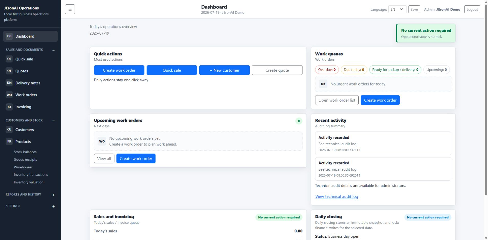
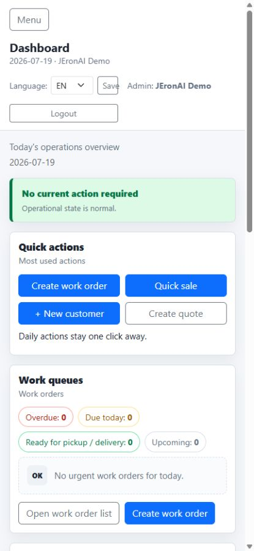

# UI Screenshots

These screenshots were captured from the current JEronAI Operations visual design.

## Desktop Dashboard

The desktop dashboard uses the current grouped sidebar, quick actions, work queues,
upcoming work, recent activity, sales and invoicing, and daily closing layout.

## Mobile Dashboard

The mobile dashboard stacks the same current cards into a single-column phone layout.

Do not add screenshots from older layouts.
