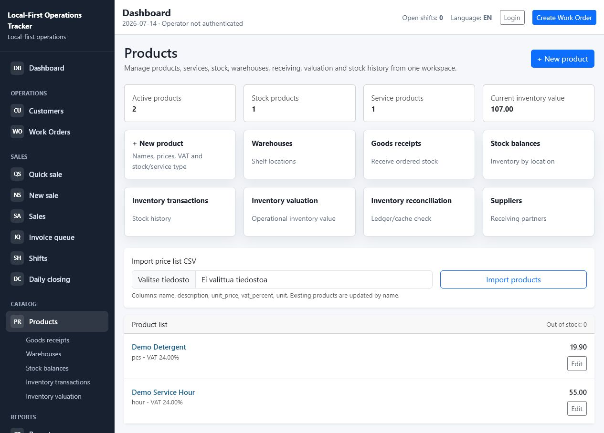
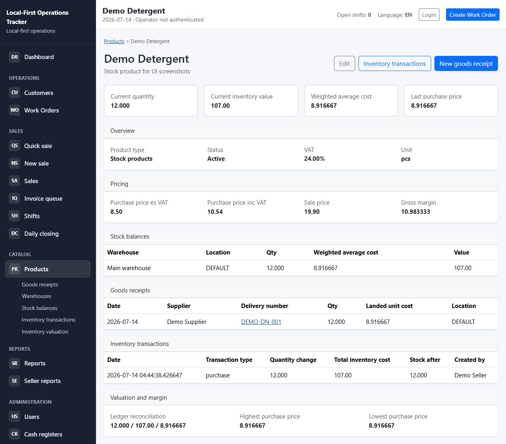
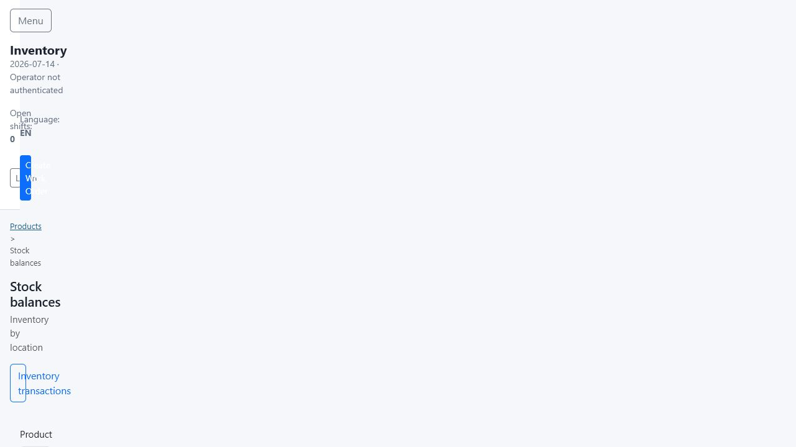
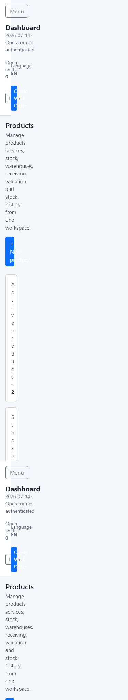

# UI Screenshots

Current dashboard screenshots for reviewing the browser and mobile layouts.

These screenshots are included so the project is easier to understand from GitHub without running the application locally. They show the current MVP dashboard after the navigation, live-search, responsive-table, and dashboard layout work.

## Browser Dashboard

The browser layout uses a persistent left navigation and a dense operations dashboard. The first row summarizes urgent work, today's work, ready work, today's sales, open shifts, and daily closing state. The lower panels show work needing attention, current shift status, recent activity, and upcoming work.

## Mobile Dashboard

The mobile layout keeps the same operational information but stacks actions, KPI cards, and panels into a single readable column for phone use over LAN or Tailscale.

## Products Workspace

The Products section now acts as the single product and inventory workspace. Product master data, warehouses, shelf locations, goods receipts, stock balances, inventory transactions, valuation, reconciliation, and suppliers are reachable from one place instead of being scattered across separate top-level modules.

## Product Detail

The product detail page brings together the product overview, pricing, stock balances, recent goods receipts, inventory transactions, and valuation context for one product.

## Stock Balances

The stock balance view focuses on operational inventory by product, warehouse, and shelf location. It remains a read-only view over the inventory ledger and derived balance caches.

## Mobile Products Workspace

On mobile, the same Products workspace stacks into large tap targets and keeps receiving, stock history, valuation, and product management within the Products section.

