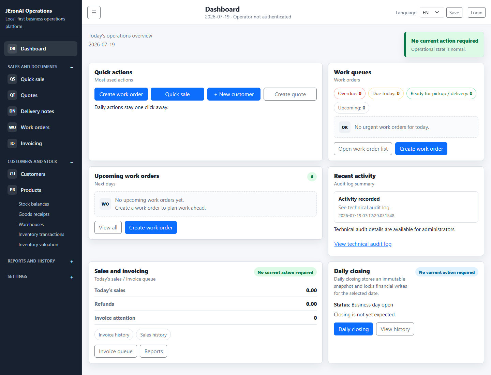

# UI Screenshots

Current JEronAI Operations screenshots for reviewing the browser and mobile layouts.

These screenshots are included so the project is easier to understand from GitHub without running the application locally. They show the current Dashboard v2 layout.

## Browser Dashboard

The desktop dashboard starts with the actions a small business uses most often. Work queues, upcoming work, recent activity, sales and invoicing, and daily closing remain visible without mixing operational documents with finalized financial transactions.

The browser layout uses a persistent left navigation with collapsible sections and a dense operations dashboard.

## Mobile Dashboard

The mobile layout keeps the same operational information but stacks actions and dashboard panels into a single readable column for phone use over LAN or Tailscale.

Additional workflow screenshots should be added only after they have been refreshed from the current visual design.
