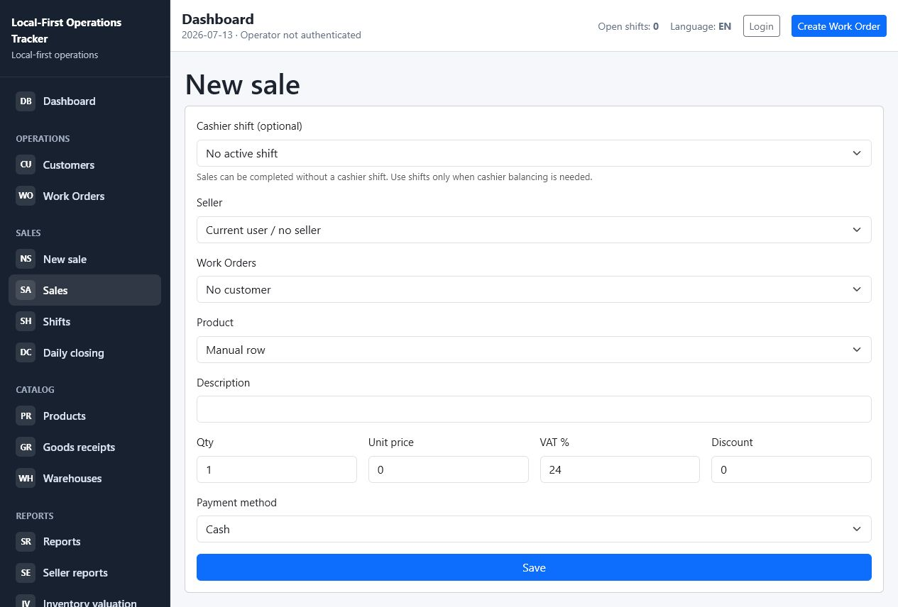
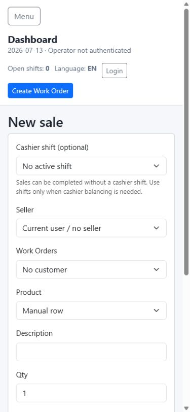

# UI Screenshots

Current dashboard screenshots for reviewing the browser and mobile layouts.

These screenshots are included so the project is easier to understand from GitHub without running the application locally. They show the current MVP dashboard after the navigation, live-search, responsive-table, and dashboard layout work.

## Browser Dashboard

The browser layout uses a persistent left navigation and a dense operations dashboard. The first row summarizes urgent work, today's work, ready work, today's sales, open shifts, and daily closing state. The lower panels show work needing attention, current shift status, recent activity, and upcoming work.

## Mobile Dashboard

The mobile layout keeps the same operational information but stacks actions, KPI cards, and panels into a single readable column for phone use over LAN or Tailscale.

## Optional Cashier Shift Sale Form

The sale form now treats cashier shifts as an optional accounting and balancing tool. A sale can be completed when no active shift exists, while businesses that use cashier balancing can still attach the sale to an open shift.

## Optional Cashier Shift Mobile Sale Form

The mobile form keeps the same workflow usable on a phone: the cashier shift selector is optional, the seller selector can be left empty, and the primary save action remains available.

