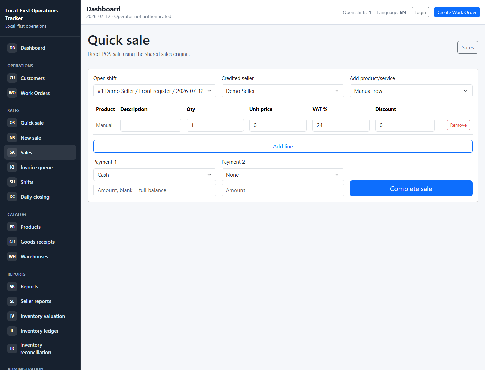
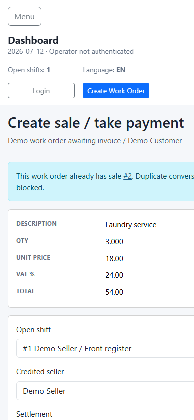

# Unified Sales Flow Screenshots

These screenshots document the new shared sales flow for the draft pull request.

## Desktop: Quick Sale

The quick sale screen creates direct POS sales through the same `Sale`, `SaleLine`,
`Payment`, and inventory services used by work-order billing.

## Mobile: Work Order Billing

The work-order billing screen reviews billable rows, prevents duplicate conversion,
and lets the operator choose the settlement path without treating the work order as
an invoice.

